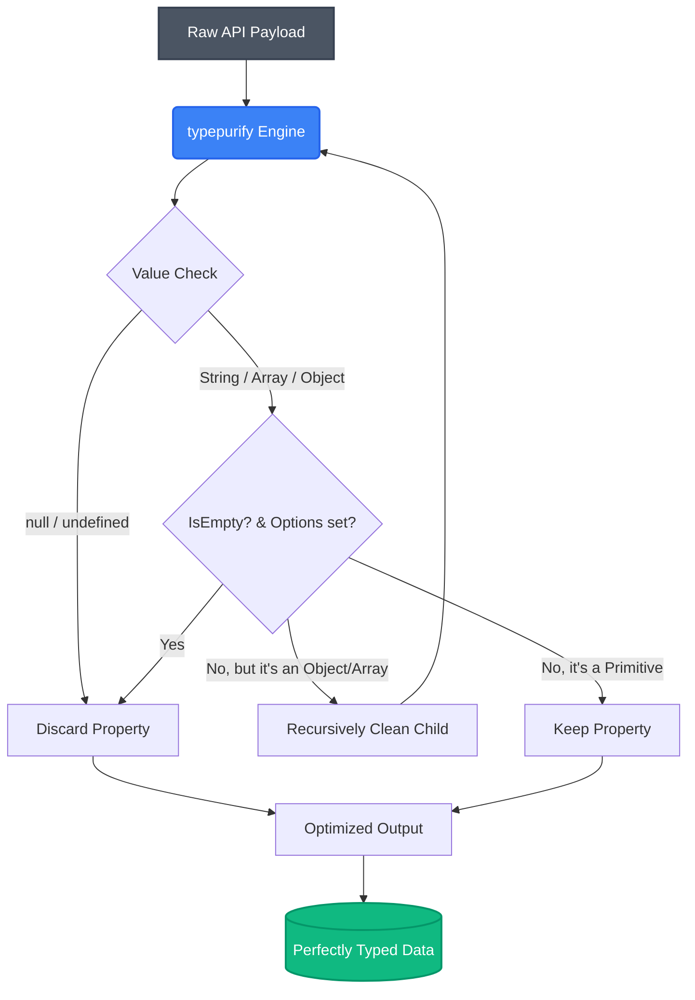

<div align="center">
  <h1>✨ typepurify</h1>
  <p>Deep-clean any API response while preserving precisely inferred recursive types—no schemas, no boilerplate.</p>
</div>

---

[](https://www.npmjs.com/package/typepurify)
[](https://opensource.org/licenses/MIT)
[](https://github.com/vallarasuk/typeclean/actions)

## Overview

`typepurify` is a lightning-fast, zero-schema data cleaner designed to deeply strip `null`, `undefined`, and optionally empty strings/arrays/objects from your data maps while keeping your TypeScript types perfectly aligned.

Instead of writing complex Zod or Joi schemas just to clean a payload, `typepurify` automatically re-infers your types at compile-time and safely handles nested records and array structures.

---

## 🧠 How it Works

Understanding how `typepurify` processes your data is simple. It uses a recursive engine to traverse your nested payloads and instantly strips out unwanted, empty, or undefined values based on your configuration.



## Installation

```bash
npm install typepurify
# or
yarn add typepurify
# or
pnpm add typepurify
```

## Usage

```typescript
import { clean } from 'typepurify';

const messyPayload = {
  id: 101,
  profile: {
    title: null,
    geo: 'IN',
  },
  tags: ['React', null, 'TypeScript'],
  emptyString: '',
  emptyArray: [],
};

// Standard clean (removes null and undefined natively)
const cleanPayload = clean(messyPayload);
/* Result: 
{ 
  id: 101, 
  profile: { geo: "IN" }, 
  tags: ["React", "TypeScript"], 
  emptyString: "", 
  emptyArray: [] 
} 
*/
// Note: Types are automatically inferred! `title` is instantly removed from the `profile` type at compile time.

// Aggressive clean with Options
const ultraCleanPayload = clean(messyPayload, {
  stripEmptyStrings: true,
  stripEmptyArrays: true,
});
/* Result: 
{ 
  id: 101, 
  profile: { geo: "IN" }, 
  tags: ["React", "TypeScript"] 
} 
*/
```

## API

### `clean<T>(obj: T, options?: CleanOptions): DeepRequired<T>`

Recursively deep-cleans null/undefined values from objects and arrays, dynamically re-inferring compile-time types without generating heavy schemas.

**Options:**

- `stripEmptyStrings` (boolean): Removes empty strings `""`.
- `stripEmptyArrays` (boolean): Removes arrays with zero length `[]`.
- `stripEmptyObjects` (boolean): Removes objects with no keys `{}`.

## Contributing

Contributions, issues, and feature requests are welcome! See our [Contributing Guidelines](CONTRIBUTING.md) for more details.

## License

This project is licensed under the [MIT License](LICENSE).

---

## About Me

**Vallarasu Kanthasamy**

I'm a software engineer deeply passionate about creating frictionless, robust developer tools and scalable architectures. I built `typepurify` to eliminate the friction of dealing with messy API payloads in enterprise TypeScript environments.

- GitHub: [@vallarasuk](https://github.com/vallarasuk)
- If you find this package useful, feel free to give it a ⭐️ on GitHub and reach out for collaborations!
